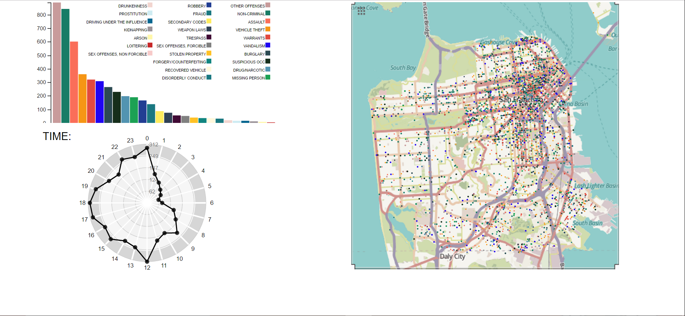
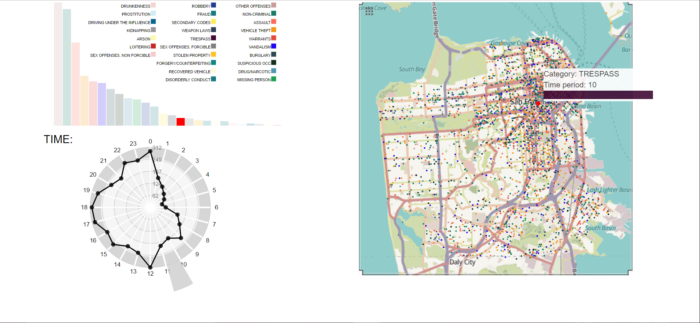
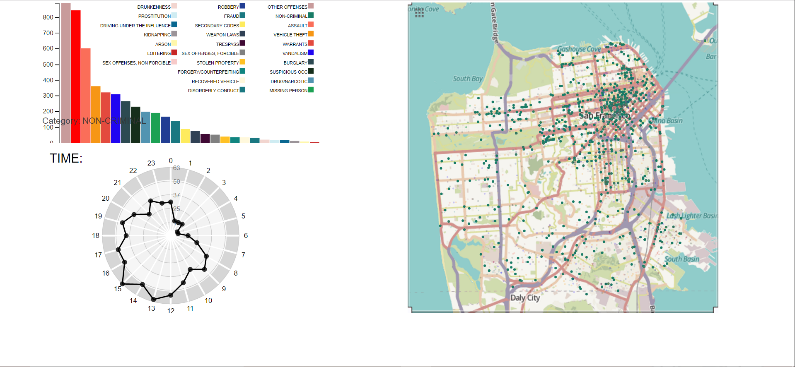
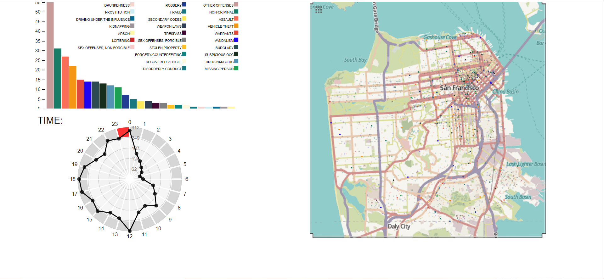

San Fransico Crime Visualization - Visualizations and Multiple Views  
===

Link: [gh-page](https://codescracker.github.io/San-Fransico-Crime-Visualization/)
 
Teams
---
Shaowei Gong, codescracker

Zhaojun Yang, yzj1212

Project Description
---
In this assignment, we aim to visualize the crime data of San Francisco City in 2015. It focus on 3 critical factor of 
crimes: place, time and type. 

To display the positions of crimes, we mark each crime in the map of San Francisco City. 
We calculate the count of the crime data by grouping crime types and crime time separately. We use bar chart to describe the count of each crime type, each bar represents a kind of crime type, 
the height of bar stands for the count of that specific type of crime. We use radar chart to show the count of crime of each time period. 
The axises of radar chart represents a time period, the length of of point in each axis stands for count of crime during that particular time period and the arcs represents a time period. 

Technical Achievements
---
In this assignment, we were faced with the problem of filtering large amount of data based on different attributes(time period, 
category) repeatedly. To solve this problem, we used a library called crossfilter. 
Crossfilter is a JavaScript library for exploring large multivariate datasets in the browser. 
Crossfilter supports extremely fast (<30ms) interaction with coordinated views, even with datasets containing a million or more records.
With crossfilter, the coordinations between the graphs become very smooth.

Design Achievements
---
**Design of Map:**

We mark each crime as a dot in the map of San Francisco City according to coordinates of crime. 
Each dot has its own color based on the type of crime. 
When our users put the mouse on the dot, the size of dot will be enlarged and the color becomes red. 
Also, the tooltip for dot will show up and display the crime type, crime time and a color bar which notifies the crime type. 
 
**Design of Bar Chart:**
We use bar chart to describe the count of each crime type, each bar represents a kind of crime type, 
the height of bar stands for the count of that specific type of crime. 
Each bar has its own color based on the crime type. 
When our users put the mouse on the bar, the specific bar will be turned into red. 
Also, the tooltip for bar will show up by the side of bar, displaying the type of crime. 

**Design of Radar Chart:**
We use radar chart to show the count of crime of each time period. 
The axises of radar chart represents a time, 
the length of of point in each axis stands for count of crime during that particular 
time period and the arcs represents a time period. When our user put the mouse on an arc, the arc will become red.

**Design of interaction of Map with Bar Chart and Radar Chart:**

When our user put the mouse on the dot, the bar in the Bar Chart that represent 
the crime type that the dot belongs to will become red, other bars' opacity will become low; 
the arc in the Radar Chart that corresponds to the crime time of the dot will extend. 

**Design of interaction of Bar Chart with Map and Radar Chart:**

When our users put the mouse on a bar, which represent a kind of crime type, 
all the dots on the map that do not belongs to this kind of crime will become obvious; 
the Radar Chart will display the crime time distribution of that specific crime type.

**Design of interaction of Radar Chart with Map and Bar Chart:**

When our users put the mouse on an arc which represents a time period of crime, 
all the dots on the map do not belongs to this time period will become less obvious; 
the Bar Chart will the display different crime types of this time period. 

Collaboration
---
Shaowei was in charge of implementing the map and coordination between map and two other graphs.

Zhaojun was in charge of the implementation of radar chart, bar chart and the coordination between them. 